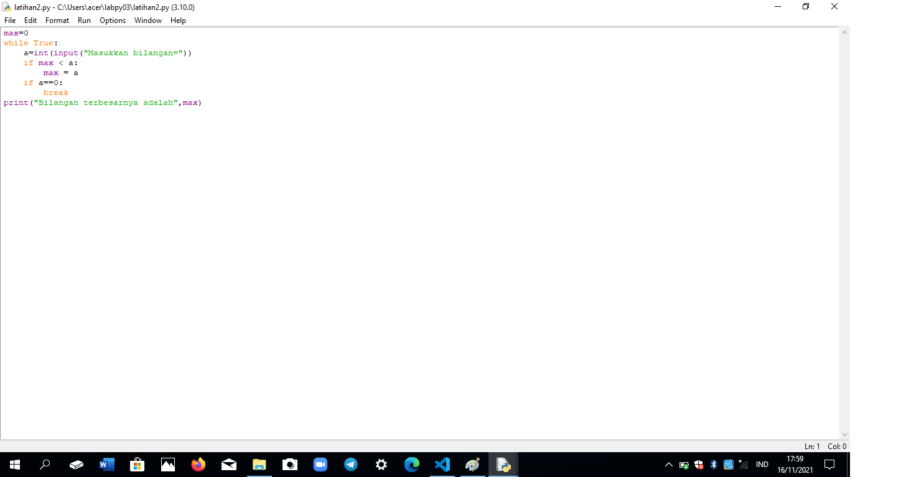

# labpy03
## Penjelasan

# Praktikum 1
## Soal Lab 2 Latihan 1
- Buat program sederhana dengan input 2 buah bilangan, kemudian tentukan bilangan terbesar dari kedua bilangan tersebut menggunakan statement if.

## Penjelasan Lab 2 Latihan 1
- Buka aplikasi python
- Pilih menu file, tekan new file
- contoh seperti gambar dibawah ini 

- Lakukan kodingan seperti gambar dibawah ini

- Jika sudah lakukan save as
- pilih menu Run, lalu tekan Run Module F5
- contoh seperti gambar dibawah ini

- Maka akan muncul hasilnya seperti gambar dibawah ini
- Sebelum itu ketikan angka terlebih dahulu lalu tekan enter

# Soal Lab 3 Latihan 2
- Tampilkan n bilangan acak yang lebih kecil dari 0.5.
- nilai n diisi pada saat runtime
- Anda bisa menggunakan kombinasi while dan for untuk menyelesaikannya

## Penjelasan Lab 3 Latihan 2
- Buka aplikasi python
- Pilih menu file, tekan new file
- contoh seperti gambar dibawah ini

- Lakukan kodingan seperti dibawah ini

- Jika sudah lalukan save as
- Pilih menu Run, lalu tekan Run Module F5
- Contoh seperti gambar dibawah ini

- Maka akan muncul hasilnya seperti gambar dibawah ini

# Labspy02
## Penjelasan

# Praktikum 2
## Soal Program Input Tiga Buah Bilangan
- Buat program sederhana dengan input tiga buah bilangan, dari ketiga bilangan tersebut tampilkan bilangan terbesarnya. Gunakan statement if.
- Sertakan flowchart

## Penjelasan Program Input Tiga Buah Bilangan
- Buka aplikasi python
- Pilih menu file, tekan new file
- contoh seperti gambar dibawah ini

- Lakukan kodingan seperti dibawah ini

- Jika sudah lakukan save as
- Pilih menu Run, lalu tekan Run module F5
- Contoh seperti gambar dibawah ini

- Maka akan muncul hasilnya seperti gambar dibawah ini
- Sebelum itu ketikan angka terlebih dahulu lalu tekan enter

## Flowchart

# Labpy03
## Penjelasan

# Praktikum 3
## Soal Latihan 1
- Tampilkan n Bilangan acak yang lebih dari 0.5.
- Nilai n diisi pada saat runtime
- Anda bisa menggunakan kombinasi while dan for untuk menyelesaikannya
- Gunakan fungsi random() yang dapat diimport terlebih dahulu

## Penjelasan Latihan 1
- Buka aplikasi python
- Pilih menu file, tekan new file
- Contoh seperti gambar dibawah ini

- Lakukan kodingan seperti dibawah ini

- Jika sudah lakukan save as
- Pilih menu Run, lalu tekan Run Module F5
- Contoh seperti gambar dibawah ini

- Maka akan muncul hasilnya seperti gambar dibawah ini

# Soal Latihan 2
- Buat program untuk menampilkan bilangan terbesar dari n buah data yang diinputkan. Masukkan angka 0 untuk berhenti.

## Penjelasan Latihan 2
- Buka aplikasi python
- Pilih menu file, tekan new file
- Contoh seperti gambar dibawah ini

- Lakukan kodingan seperti dibawah ini

- Jika sudah lakukan save as
- Pilih menu Run, lalu tekan Run Module F5
- Contoh seperti gambar dibawah ini

- Maka akan muncul hasilnya seperti gambar dibawah ini
- Sebelum itu ketikan angka terlebih dahulu lalu tekan enter

# Soal Program 1
- Seseorang pengusaha menginvestasikan uangnya untuk memulai usahanya dengan modal awal 100 juta, pada bulan pertama dan kedua belum mendapatkan laba, pada bulan ketiga baru mulai mendapatkan laba sebesar 1% dan pada bulan ke 5, pendapatan meningkat 5%, selanjutnya pada bulan ke 8 mengalami penurunan keuntungan sebesar 2%, sehingga laba menjadi 3%. Hitung total keuntungan selama 8 bulan berjalan usahanya.

## Penjelasan Program 1
- Buka aplikasi python
- Pilih menu file, tekan new file
- Contoh seperti gambar dibawah ini

- Lakukan kodingan seperti dibawah ini

- Jika sudah lakukan save as
- Pilih menu Run, lalu tekan Run Module F5
- Contoh seperti gambar dibawah ini

- Maka akan muncul hasilnya seperti dibawah ini

Selesai